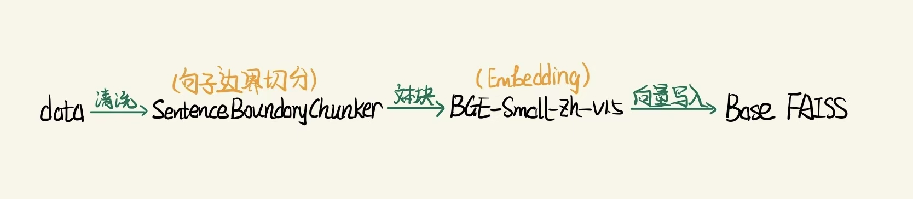
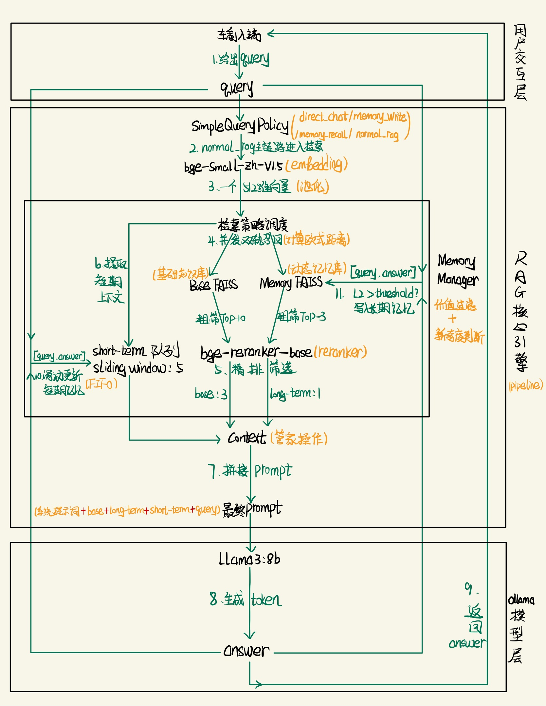

# Memory RAG System: 带有动态上下文记忆的本地化检索增强生成系统

## 项目简介

本项目是一个基于本地化大模型（Ollama + Llama3）与 FAISS 向量库构建的检索增强生成（RAG）系统。

系统设计了独立的 `MemoryManager` 动态记忆管理器，将静态基础知识库与用户长期记忆库进行物理隔离；同时在 `RAGPipeline` 前置轻量级 `QueryPolicy` 意图分流层，对身份闲聊、历史记忆回忆和普通 RAG 问答进行不同路径调度。

系统不仅能够基于静态基础知识库进行问答，还能在多轮对话中选择性沉淀用户目标、偏好和计划，并支持程序重启后的长期记忆召回。

---

## 系统架构图 Architecture

### 1. 离线冷启动与知识建库

<div align="center">
  
  <p><em>图 1: 离线冷启动：句子边界切分与基础知识库向量化</em></p>
</div>

### 2. 在线问答与记忆沉淀闭环

<div align="center">
  
  <p><em>图 2: 在线阶段：QueryPolicy 意图路由、双库检索与动态记忆更新</em></p>
</div>

---

## 核心架构亮点

- **轻量级 QueryPolicy 意图分流**：在 `RAGPipeline` 前置规则式意图判断，将用户输入划分为 `direct_chat`、`memory_recall` 与 `normal_rag` 三类，避免身份闲聊类问题被基础知识库带偏，并为“我之前说过什么”等历史记忆回忆问题提供专门检索路径。

- **双库向量检索架构**：物理隔离 `Base Knowledge`（静态基础知识库）与 `User Memory`（动态长期记忆库），降低日常对话、基础知识和用户长期记忆之间的交叉污染。

- **动态记忆管理机制**：通过 `MemoryManager` 对用户目标、计划、偏好等信息进行价值过滤、新奇度判断和长期记忆写入，避免将普通知识问答或闲聊内容全部写入用户记忆库。

- **Bi-Encoder + Cross-Encoder 两阶段检索**：使用 `bge-small-zh-v1.5` 进行向量召回，再使用 `bge-reranker-base` 进行精排，提升基础知识库与长期记忆库的检索质量。

- **历史记忆回忆检索策略**：针对“我之前说过什么 / 你还记得我吗”等泛化记忆查询，单独采用 `memory_recall` 检索路径，只检索 `User Memory`，放宽召回阈值并跳过 reranker，提升重启后长期记忆召回稳定性。

- **U 型 Prompt 组装策略**：将基础知识库放在 Prompt 前部，近期连续对话放在 Prompt 后部，结合大模型首尾注意力偏好，缓解部分 Lost in the Middle 现象。

- **显存监控与可视化**：系统内置后台显存监控线程，在运行结束或异常退出时生成显存变化折线图，便于观察本地模型运行时的资源占用情况。

- **配置与代码解耦**：采用 `.env` 环境变量注入机制，将模型路径、向量库路径、召回阈值等参数从业务代码中解耦，方便本地实验与后续迁移部署。

---

## 技术栈

- **LLM**：`Llama3:8b` via Ollama
- **Embedding Model**：`bge-small-zh-v1.5`
- **Reranker Model**：`bge-reranker-base`
- **Vector Store**：FAISS
- **Frameworks**：PyTorch, Transformers, Matplotlib
- **Runtime**：Python 3.9+

---

## 核心目录结构

```text
MemoryRAG/
├── assets/
│   ├── offline_cold_start.jpg       # 离线知识建库流程图
│   └── online_qa.jpg                # 在线问答与记忆沉淀流程图
│   └── test_log1.png                # 测试日志1图
│   └── test_log2.png                # 测试日志2图
├── data/                            # 基础知识库文本存放处
├── docs/
│   ├── test_cases.md                # 轻量化功能测试用例
│   └── demo_log.md                  # Demo 运行日志
├── memory/
│   └── memory_manager.py            # 记忆管理层：短期记忆、长期记忆写入、普通 RAG 检索与历史回忆检索策略
├── models/                          # 模型加载层：Embedding、Reranker、LLM 接口
├── pipeline/
│   └── rag_pipeline.py              # 流程调度层：QueryPolicy 意图分流、检索策略选择与 Prompt 构造
├── retrieval/
│   └── vector_store.py              # FAISS 向量库封装
├── utils/
│   └── text_splitter.py             # 句子边界切分器 Sentence Boundary Chunker
├── monitor.py                       # 显存监控与图表生成
├── config.py                        # 全局配置中心
└── main.py                          # 系统启动入口
```

---

## 快速部署

### 1. 环境要求

建议使用 Python 3.9+ 虚拟环境。

```bash
conda create -n memory_rag python=3.9
conda activate memory_rag
```

### 2. 安装依赖

```bash
pip install -r requirements.txt
```

### 3. 配置环境变量

复制配置模板并按需修改：

```bash
cp .env.example .env
```

### 4. 准备基础知识库文本

请在 `data/` 目录下放置合法的 `.txt` 文本文件，并在 `.env` 中指定 `DATA_PATH`。

### 5. 启动系统

```bash
python main.py
```

系统启动后会自动检查基础知识库索引。如果基础知识库尚未建立索引，系统会自动完成文本切分、向量化和入库。

---

## 功能测试

项目提供轻量化功能测试记录，覆盖 QueryPolicy 拦截、基础知识库检索、长期记忆写入、历史记忆回忆、重启后记忆持久化等核心链路。

- [测试用例说明](docs/test_cases.md)
- [Demo 运行日志](docs/demo_log.md)

核心测试场景包括：

| 编号 | 测试目标 | 示例输入 | 验证点 |
|---|---|---|---|
| TC-01 | 身份类 Query 拦截 | 你是谁 | 不进入知识库角色扮演，不写入长期记忆 |
| TC-02 | 基础知识库问答 | 孙悟空是谁 | 能从 Base Knowledge 检索相关知识 |
| TC-03 | 普通知识问答过滤 | 孙悟空是谁 | 普通知识问答不写入 User Memory |
| TC-04 | 用户目标写入长期记忆 | 我的目标是找一份 RAG 实习 | 用户目标被写入动态记忆库 |
| TC-05 | 当前会话历史记忆回忆 | 我之前说过什么 | 触发 memory_recall 检索策略 |
| TC-06 | 重启后长期记忆召回 | 重启后问：我之前说过什么 | 验证 Memory FAISS 持久化成功 |

---

## 后续架构演进路线 Future Work

在当前 V1.0 系统基础上，后续可以从数据治理、检索策略、记忆生命周期和 Agent 化方向继续迭代。

- [x] **引入规则式 QueryPolicy 意图分流**：当前版本已实现基于规则的轻量级 QueryPolicy，将输入划分为身份闲聊、历史记忆回忆与普通 RAG 问答三类，并在 Pipeline 层选择不同检索策略。

- [ ] **升级为语义级 Query Router**：后续可引入 embedding-based intent matching、轻量分类器或 LLM Router，提升对模糊表达、多意图 Query 和复杂任务指令的泛化能力。

- [ ] **工业级数据预处理与治理 Data ETL Pipeline**：重构数据接入层，引入更精细的文本清洗、去噪、去重和语义切分策略，提升 Chunking 质量，从源头减少 RAG 系统的“垃圾进，垃圾出”问题。

- [ ] **Metadata 混合检索与时序衰减机制 Hybrid Search & Time Decay**：在文本切片入库前提取实体、时间、来源等元信息，结合向量检索和元数据过滤；同时在 User Memory 中引入时间衰减权重，使近期记忆在用户相关问题中拥有更高优先级。

- [ ] **外部 KV Buffer 与摘要索引优化**：探索以结构化 Key-Value 形式管理动态记忆，并在原始记忆写入前抽取摘要或核心意图，实现“摘要建库，原文召回”，降低长期记忆库膨胀带来的检索噪声。

- [ ] **基于动态阈值的记忆生命周期管理 Memory Lifecycle & Eviction**：升级当前静态距离阈值去重逻辑，引入检索频率、最近访问时间和记忆价值评分，对长期未被激活的低价值记忆进行合并、降级或删除。

- [ ] **向 Agentic RAG 演进**：将基础知识库检索、用户记忆检索和外部工具调用封装为 Tools，由大模型根据任务目标自主规划调用顺序，实现从被动检索到主动探查的范式升级。

---

## 免责声明

本项目及其代码仅供学术研究与工程技术交流使用。请确保用于索引和检索的文本数据具备合法使用权限。开发者不对用户上传、索引及生成的任何内容承担责任。